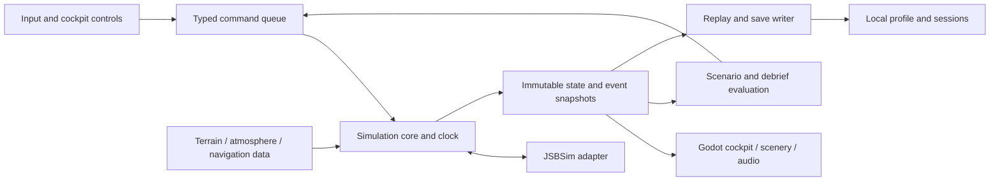

# Architecture and technology plan

Status: selected planning baseline; runtime integration remains subject to the P1 proof gates below. Researched 2026-10-03. This document defines engineering contracts for parallel implementation; it is not evidence that the simulator exists or that its aircraft has been validated.

## Outcome and technical choices

Build a standalone Windows 11 x64, offline-first simulator around one carefully identified Cessna 172S configuration with fuel injection and conventional instruments. The aircraft configuration must be traceable to a serial applicability range, equipment list, engine/propeller combination, and authorized POH/performance references before its behaviors receive a realism claim. Future aircraft load through capabilities and data packages rather than C172-specific conditionals throughout the application.

The primary experience is a readable, interactive cockpit and a believable complete flight: planning, walkaround, startup, taxi, run-up, takeoff, maneuvering, navigation, communication, approach, landing, shutdown, and review. The architecture treats the pilot's decisions, aircraft systems, weather, scenery, and instruments as parts of the same scenario. Rendering quality must support visual flying and cockpit use, while aircraft truth remains available to a headless validation runner.

Default design target: i9-12900K, RTX 3090, approximately 64 GB RAM, Windows 11; these are the machine specifications reported earlier in the conversation and must be captured in the first benchmark report. Start with a single monitor and keyboard/mouse support; support gamepads and calibrated yoke/joystick/throttle/rudder devices through the same command interface. VR, force feedback, instructor networking, and public multiplayer follow the desktop fidelity gates.

| Layer | Selection | Reason and constraint |
| --- | --- | --- |
| Presentation engine | Godot **4.7.2**, standard precision, Forward+ | Small standalone distributable, editable text scenes, open tooling, native extension interface. Use Vulkan initially and test Direct3D 12 fallback on Windows. |
| Presentation language | Typed GDScript | Menus, scene wiring, cockpit animation, input configuration, accessibility, audio routing; no authoritative aerodynamic integration. |
| Simulation | C++20 `sim_core`, dynamically linked **JSBSim 1.3.1** | Aircraft dynamics run without Godot. One audited adapter owns JSBSim property mappings and unit conversions. |
| Engine bridge | `godot-cpp` GDExtension | Pin godot-4.5-stable commit e83fd0904c13356ed1d4c3d09f8bb9132bdc6b77, its 4.5 single-precision API on engine 4.7.2, and the same Windows toolchain/CRT policy as native libraries. Toolchain CI proves native initializer loading; simulator bridge/export loading remains a separate gate. See [ADR-001](decisions/001-engine-and-native-stack.md). |
| Persistence | SQLite **3.53.4** C API, plus versioned replay files | No server or account dependency; transactions for profiles/progress; immutable files for high-volume sessions. Exact source checksum enters the dependency lock. |
| Native build | CMake, Ninja, MSVC 2022 x64 | C++20 baseline; pinned compiler/build environment; CTest for engine-independent contracts and performance fixtures. Confirm required installed Build Tools in P1. |
| Data/build tools | CPython 3.13 family, locked dependency environment | Conservative supported baseline for data libraries, schema validation, source ingestion, golden trace comparison, packaging. Pin exact patch and wheel hashes after Windows dependency-resolution spike. Python is a build tool, not a required end-user install. |
| Assets | Blender 4.5 LTS family; glTF 2.0/GLB export | Human-editable source assets; reviewed mesh/unit/animation pipeline. Pin an exact supported LTS patch after exporter test. |
| Formats | JSON + JSON Schema; GeoTIFF at import; compiled tile packages | Human-reviewed manifests, stable versioning, reproducible conversion. Runtime consumes compact preprocessed packages rather than arbitrary source GIS formats. |
| Tests and delivery | GitHub Actions, Windows exported smoke tests, GitHub Releases | Documentation CI exists first; runtime checks are added when runnable code exists. Portable ZIP is first runtime distribution; installer is a later issue. |

Godot's official archive lists 4.7.2 as stable and 4.8 as development as of the research date. JSBSim's official releases list 1.3.1. SQLite's release history lists 3.53.4. The native source/editor pins are resolved in [the dependency lock](../third_party/dependencies.lock.json); unimplemented authoring/data-tool choices remain planning pins, not an instruction to automatically upgrade to whatever a download page labels latest. [Godot archive](https://godotengine.org/download/archive/), [JSBSim releases](https://github.com/JSBSim-Team/jsbsim/releases), [SQLite release history](https://www.sqlite.org/changes.html).

Godot is MIT licensed; JSBSim's tagged COPYING contains LGPL 2.1 terms; SQLite publishes its code in the public domain. Keep project-owned code under the repository's existing MIT license and track dependency/data licenses separately. Ship notices, exact JSBSim corresponding source/build instructions and any modifications, and an application build that permits replacing the JSBSim DLL. Dynamic linking is an engineering compliance choice, not a substitute for checking the exact release's obligations. Aircraft XML, terrain, imagery, fonts, sounds, POH material, and instrument artwork each require their own provenance review. [Godot license](https://godotengine.org/license/), [JSBSim COPYING](https://github.com/JSBSim-Team/jsbsim/blob/v1.3.1/COPYING), [SQLite copyright](https://www.sqlite.org/copyright.html).

## Why this stack

These comparisons are design judgments about this project's requirements, not claims that another engine cannot build a flight simulator.

| Approach | Useful strengths | Cost/risk for this project | Decision |
| --- | --- | --- | --- |
| Godot + JSBSim | Open toolchain; C++ dynamics can be validated without graphics; small regional scope; text scenes and low-cost CI | Regional terrain streaming, cockpit authoring, and JSBSim integration must be built; native ABI/precision pairing needs discipline | Selected, conditional on P1 integration and rendering proofs |
| Unreal + JSBSim | Strong high-end rendering and scene authoring; C++ integration | Larger toolchain/build footprint, standard Epic account requirement and proprietary distribution terms; paid assets can hide unverified systems assumptions | Owner chose account-free Godot; reconsider only with explicit owner acceptance of account requirement |
| Unity + JSBSim | Mature UI/tool ecosystem and C# development | Proprietary licensing/eligibility and managed/native boundary; no project-specific advantage established by this team | Reconsider only with a measured authoring or performance advantage |
| Custom renderer/engine | Full control of every subsystem | Requires building input, editor, rendering, import, audio, UI, export, and profiling before aircraft validation | Rejected for initial product |
| FlightGear extension/fork | Existing world, aircraft ecosystem, JSBSim integration, Windows support | Adopts a broad existing product architecture and GPL distribution model; tailored learning/progress experience still needs integration | Valid fallback if standalone scope proves unaffordable; use as a reference, with per-asset license review |
| Commercial simulator add-on | Existing globe/weather/hardware ecosystem | Host purchase/runtime dependency and SDK/platform restrictions; user asked for a project we can own and release | Deferred alternative, not initial delivery |

Unreal's official licensing distinguishes royalty-based runtime products and seat-based uses. Unity Personal eligibility currently uses a $200,000 revenue/funding limit. FlightGear is distributed under the GPL. Recheck terms before any stack change or paid distribution; initial selection does not depend on a royalty-free promise from these alternatives. [Unreal licensing](https://www.unrealengine.com/license), [Unity Personal](https://unity.com/products/unity-personal), [FlightGear license](https://www.flightgear.org/about/license/).

Godot Forward+ supports Vulkan and Direct3D 12 through RenderingDevice. GDExtension avoids rebuilding the whole engine, but its engine version and precision compatibility still require pinned builds. [Godot renderer overview](https://docs.godotengine.org/en/stable/tutorials/rendering/renderers.html), [godot-cpp compatibility](https://docs.godotengine.org/en/4.7/tutorials/scripting/cpp/about_godot_cpp.html).

## Dependency and repository layout

This is the intended implementation layout, to be created in P1/P2. Keeping contracts and validation independent of scenes allows agents to work with small fixtures before full assets exist.

```text
app/                       Godot project, scenes, typed presentation scripts
native/
  sim_core/                clock, aircraft/system ownership, commands and state
  fdm_jsbsim/               audited JSBSim adapter, model loading, ground callback
  godot_bridge/             GDExtension facade; no aircraft-specific physics
  world_core/               geodesy, terrain queries, scenery/navdata catalog
  persistence/              SQLite repository, replay writer, migrations
schemas/                    contracts and migration fixtures
content/
  aircraft/                 versioned aircraft manifests and authored data
  scenarios/                lesson definitions and event/rubric data
  world/                    small reviewed fixtures and package manifests
assets_source/              source .blend, source textures, original audio
tools/                      ingestion, validation, packaging, performance reports
tests/                      headless traces, contract/behavior fixtures, smoke scenes
docs/                       product plan, realism validation, operations, phases, ADRs
third_party/                locked source recipes, licenses, notices, patch manifests
```

Do not commit entire tool installs, generated Godot `.godot` caches, build trees, or global terrain datasets. Keep small fixtures and manifest hashes in Git; larger original assets may use Git LFS after a storage/quota decision. Publish built scenery packs separately through Releases with an exact content manifest. A dependency lock records version, commit, source URL, SHA-256, license, compiler ABI, and local patches. Toolchain updates are separate PRs with native load, golden trace, save migration, and export regression evidence.

No automatic engine fork, Terrain3D dependency, proprietary GIS SDK, internet service, or hosted database is required. A terrain add-on may be adopted only after its exact license/version, Godot ABI, runtime package footprint, origin-rebase behavior, and offline export are tested against the same contracts as a custom tile streamer.

## Modules and single ownership



| Module | Owns | Publishes / consumes | Must not do |
| --- | --- | --- | --- |
| Simulation clock | Integer ticks, pause, time scale, scenario time | Tick-stamped commands, state/events | Use render delta as integration step |
| FDM adapter | JSBSim lifecycle, aerodynamic/propulsion integration, gear reaction, unit bridge | Physical truth snapshot, consumption/mass/force diagnostics | Permit arbitrary UI property writes or a second aircraft rigid-body solver |
| Aircraft systems | Electrical buses, switch state, starter interlocks, instrument sensor state, failure state, supported avionics | Verified controls into FDM, observed cockpit channels | Animate a switch without changing its system state |
| World core | Double-precision geodesy, terrain/contact surface, source dates, obstacle catalog | Bounded nonblocking terrain queries; navdata snapshot | Query Godot scene tree on the simulation thread |
| Weather | Deterministic atmosphere/wind/turbulence field with seed and recorded changes | Density/pressure/temperature and wind into physics; common cloud/visibility/light parameters into renderer | Make visible clouds independent of the scenario weather truth |
| Navigation/comms | Navaid propagation/availability, tuned radio state, traffic and ATC state machines | Receiver indications, message events, clearances | Treat every tuned frequency as always in range or replace ATC truth with generated text |
| Scenario evaluator | Objectives, procedural events, safety rubric, assistance classification | Tick-stamped guidance/failure commands and evidence | Read hidden truth for trainee cockpit hints when scenario prohibits it |
| Presentation | Camera, local origin, cockpit hit targets, instrument rendering, spatial sound, optional HUD | Reads observed channels; submits commands | Own fuel, electrical state, aircraft location, or performance limits |
| Input adapter | Bindings/calibration/hot-plug/focus-loss behavior | Normalized controls, source/device/time metadata | Couple physics to one vendor or bypass authority arbitration |
| Persistence | Profiles, session metadata, transactions, replay chunks, compatibility checks | Save receipts, migration result, integrity status | Block the 120 Hz loop on disk/network or silently reinterpret an incompatible save |

Write down the owner for every state variable in a systems mapping before implementing it. In the initial C172S, JSBSim's propulsion model owns fuel burned and remaining tank mass; project electrical systems own bus voltage and starter availability. Project code supplies validated controls/interlocks and reads JSBSim outputs. A future custom engine/fuel model requires an ADR transferring ownership, with JSBSim's overlapping consumption disabled and mass/CG supplied consistently. Avoid double-counted fuel or an electrical starter that runs a visually stopped engine.

The P1 dynamics proof uses the [original synthetic fixture](../native/fdm_jsbsim/README.md), authored under MIT with exact byte provenance. It proves the adapter and numerical schedule only. Upstream C172P/C172x XML is excluded by the rights review; it is not a redistributable development seed or a C172S substitute. The selected C172S aircraft package and serial/configuration/POH gate remain #28 and later validation work. Audit engine, fuel, mass/inertia, aerodynamics, propeller, gear and stall behavior against that target. Every aircraft declares implemented, simplified and unsupported capabilities; cockpit, lessons, failures and checklists bind to them. Do not expose features absent from the selected configuration.

## Simulation clock, ordering, and threading

Authoritative ownship integration is fixed at **120 Hz** (`dt = 1/120 s`), a proposed baseline that must pass step-convergence tests. Tick number is a `uint64`; elapsed simulation time is derived from it. Time scale changes the number of fixed steps per wall-clock interval, never `dt`. Start/end UTC and scenario UTC are distinct from elapsed time; fixed lesson weather/time continue to replay while the real clock changes.

Each step executes a documented order:

1. Drain validated commands scheduled for this tick, sort by `(tick, authority_rank, source_id, sequence)` with ascending pilot→avionics→scenario→instructor rank; later entries apply highest authority. Source IDs break equal-authority ties lexically before sequence. Producers submit monotonically increasing per-source sequences in arrival order; target ticks schedule execution independently. Return rejection receipts and publish applied records only after a successful step; retain admission order separately for reconstruction.
2. Sample the deterministic world/weather state at the previous physical state; apply scenario events and sensor/system interlocks.
3. Evaluate project-owned systems; map their controls to the FDM adapter. Step JSBSim once.
4. Read physical truth; update sensor dynamics and fault-driven indications. Feed any consumption/engine observations back to their designated system owners for the next tick.
5. Evaluate traffic/ATC/scenario jobs due this tick; publish immutable state plus ordered events. Enqueue recording records.

Cadences are integer divisors of 120: dynamics and controls at 120 Hz; fast instrument channels at 60 Hz; slower electrical/thermal/radio/traffic jobs at 20 Hz; lesson rubric aggregation at 10 Hz. Any feedback-sensitive subsystem remains at 120 Hz until its lower-rate approximation passes convergence tests. Presentation interpolates the last two physical snapshots at display refresh; observed gauges may include their own modeled lag but never renderer-dependent physics.

One dedicated simulation worker owns each JSBSim instance and its mutable systems; initial product supports one active ownship. Godot's main thread handles input/scene/UI. Bounded SPSC queues carry commands and snapshots; a separate ordered queue carries non-droppable events/recording records. A disk worker owns the SQLite write connection and replay file handles. Data workers prepare CPU-side tile buffers; texture uploads and scene attachment occur on the main thread. Cap work queues and memory; no lock-free design is required unless measured latency warrants it.

Godot documents that the active scene tree is not thread safe. Keep all scene calls out of simulation/ingestion workers; cross-thread packets contain plain owned data, not mutable Node/Resource references. [Godot thread-safe APIs](https://docs.godotengine.org/en/4.7/tutorials/performance/thread_safe_apis.html).

Controls from devices are sample-and-hold normalized axes plus ordered edge events. Instructor/scenario authority is explicit and logged. Mouse camera movement never alters control axes. Device disconnect and focus loss produce visible logged transitions; the selected pause/hold-safe policy must prevent stale full-deflection inputs. Keyboard input has rates and neutral behavior suitable for basic access, while the app identifies assisted rudder or other aids in the debrief.

A delayed frame may coalesce visual snapshots, but cannot drop control edges, clearances, failures, or saves. If the simulation falls more than 250 ms behind wall time or cannot drain a mandatory recording queue, pause with an actionable message. Do not advance with an enlarged timestep, silently discard ticks, or allow CPU-dependent training outcomes. Initial accelerated replay is capped at 4x and must satisfy step/sensor equivalence; higher headless replay speeds are a separately measured capability.

## Coordinates, units, and physical definitions

Canonical physics uses C++ `double`, SI units, and explicit frame types. No raw `Vector3` crosses the public simulation boundary without frame and unit semantics.

| Quantity / frame | Contract |
| --- | --- |
| Global position | WGS84 geodetic latitude/longitude in radians, ellipsoid height in meters; additionally derived double ECEF position in meters |
| ECEF | Earth-centered Earth-fixed, right-handed, X through equator/prime meridian, Y equator/90 degrees east, Z north pole |
| Local physics frame | NED: X north, Y east, Z down; velocity names explicitly say air-relative, ground-relative, or inertial |
| Aircraft body | X forward, Y right, Z down; angular rates `p,q,r` in rad/s; positive rotation follows right-hand rule |
| Orientation | `q_body_to_ned`, normalized quaternion `(w,x,y,z)`; transforms body vectors into local NED. Euler angles are derived display values, not integration state |
| Godot local render | X east, Y up, Z south; `p_render = (east, -down, -north)`. Compose basis transforms for orientations; do not rearrange Euler angles by guesswork |
| Mass / inertia / force | kg; kg m²; newtons and newton-meters; include position of CG and reference datum |
| Altitude | Explicit `ellipsoid_height_m`, `orthometric_msl_m`, `terrain_agl_m`, `pressure_altitude_m`, `indicated_altitude_m`; never interchangeable |
| Wind | Vector is direction **toward** in NED m/s; weather UI direction **from** is converted and tested separately |
| Heading | Explicit true and magnetic radians; declination model ID/epoch/location recorded. Runway displayed identifier is source metadata, not recomputed from every frame |
| Pilot display | ft, kt, NM, degrees, RPM, inHg/hPa, °C, lb/US gal as appropriate to the exact target's markings; conversions centralized |

Exact conversions include `ft = 0.3048 m`, `NM = 1852 m`, `kt = 1852/3600 m/s`. Fuel volume-to-mass conversions require declared temperature/density assumptions rather than a universal constant. JSBSim uses mixed aviation units and its own frame/property conventions; the adapter maintains an audited mapping for every property, including read/write direction, startup default, range, transform, and fixture. Upstream ground-callback altitude is in feet and normal/ground motion vectors are in ECEF, so callback conversion deserves independent tests. [JSBSim FGInertial API](https://jsbsim-team.github.io/jsbsim/classJSBSim_1_1FGInertial.html).

Terrain source vertical datum and geoid model must be recorded. Convert source elevations to the chosen canonical height and separately derive MSL for display; do not set an ellipsoid height equal to a charted airport elevation. Test axis signs with north/east/climb/right-turn cases, quaternion round trips, pole/date-line cases, and geoid-corrected runway placements.

Use a floating render origin derived from a double ECEF anchor. Rebase when ownship exceeds 2 km from the anchor; rebuild nearby transforms from canonical positions in one main-thread transaction. Camera, particles, lights, audio emitters, and terrain instances follow the same origin version. Physics and recorded trajectories never change because the camera origin changed. Cockpit meshes live in the aircraft's own local coordinates.

Godot's ordinary vector precision degrades far from zero, while double-precision engine builds require custom editor/export binaries and rebuilt extensions. Our initial choice is double geodesy plus local float rendering; a custom double engine is reconsidered only if the rebase/visual gate fails. [Godot large world coordinates](https://docs.godotengine.org/en/4.7/tutorials/physics/large_world_coordinates.html).

## Terrain, contact, scenery, and navigation

World truth is an immutable package catalog plus a prepared query surface around ownship. Start with a compact reviewed training region, not global streaming. Elevation tiles use a quadtree with a coarse always-present level; geometry/texture LOD is independent of contact resolution. Nearby runway/taxi surfaces have reviewed grade/material/friction/edges and overlay coarse terrain without abrupt height discontinuities.

JSBSim is the only aircraft rigid-body/gear dynamics solver. Implement its `FGGroundCallback` with queryable contact point, normal, ground linear/angular velocity, and altitude at each gear/contact location. Keep full nearby collision data resident before taxi/landing; render LOD cannot change wheel-contact truth. Godot collision shapes provide picking and obstacle queries; they do not apply a second force to ownship. Route validated obstacle contact to a project-defined crash/damage event or externally modeled force with an explicit capability test. [JSBSim ground callback API](https://jsbsim-team.github.io/jsbsim/classJSBSim_1_1FGGroundCallback.html).

Terrain requests never block the FDM step. Preload a velocity-dependent lookahead envelope and nearby intended airport. A package with missing coarse data is rejected at scenario load. Missing precise contact data triggers a controlled pause before entering the affected envelope; cosmetic texture misses can show lower detail. Exiting the installed region produces a clear boundary prompt and logged termination/return choice, not invented airports or an infinite flat plane.

Airport/navdata schema includes immutable internal ID, published identifiers, runway true bearings/dimensions/thresholds/displaced thresholds/slope/surface, declared distances where available, lights/markings, taxiway graph, hold-short/protected areas, traffic-pattern metadata, frequencies, elevations, airspace geometry and source cycle. Navaids include type/frequency/location/elevation/service-volume data and outages. A map is a view of this catalog and scenario state, with assistance policy determining whether ownship is shown.

Atmosphere and weather must affect physics, visible weather, sounds, runway conditions, and instrument indications through shared state. First releases use seeded authored presets; live weather import is a later opt-in adapter that stores the retrieved data/time and converts it into a recorded scenario field. Avoid synchronizing a flight to changing internet weather without retaining the exact samples. Pressure, density altitude, gusts, crosswind, visibility, cloud layers, turbulence, precipitation, and icing capabilities have separate support flags; unsupported icing physics cannot be presented as validated icing training.

## Contract formats and interface rules

Freeze the first contract versions before P2 parallel scene/system work. [Contracts](contracts.md) is the canonical naming/ratification register; the table here expands its proposed payloads and adds package/record subformats for the P1 schema task. Domain owners propose changes; the integrator updates consumers and fixtures in the same PR or adds a backwards-compatible field with a documented default. No undocumented property-path strings in UI or lesson code.

| Contract | Required fields / rules |
| --- | --- |
| `AircraftManifest/v1` | Package ID/version/hash; target model/configuration/serial applicability; engine/propeller/equipment; source provenance; capability IDs; FDM files and parameter versions; cockpit channel/control mapping; performance reference and validation status |
| `ControlCommand/v1` | Session ID, target tick, monotonic sequence, source, authority, typed command ID and payload; units/ranges enforced; accepted/rejected event |
| `AircraftSnapshot/v1` | Tick/time, aircraft/package hashes, geodetic/ECEF state, body-to-NED quaternion, named velocities/rates/accelerations, physical truth, configuration/mass/CG, systems/contact state and validity flags; no mutable pointers |
| `InstrumentSnapshot/v1` | Tick/time and named observed channels: value/unit, normal/failed/unreliable/off flag, sensor timestamp/tick, filtering/latency, availability/capability; debrief can retain truth separately |
| `AtmosphereSample/v1` | Tick/sample position, pressure in Pa, temperature in K, density in kg/m³, humidity policy, NED wind/turbulence m/s, seed and field/version identity |
| `GroundSample/v1` | Location/datum, contact elevation/normal/friction/material, ground velocity, validity and contact-data version; query ownership and validity envelope explicit |
| `OperationalEvent/v1` | Session ID, tick, sequence, event type, subject IDs, typed payload, evidence links; at least commands, system changes, clearance/ack, procedure evidence, assistance, pause, save, failures |
| `ScenarioManifest/v1` | ID/version/hash; region/navdata/aircraft constraints; initial physical/systems/weather state and seeds; lesson objectives, allowed aids, failure triggers, rubric version; published source references |
| `WorldPackage/v1` | ID/version/hash; geographic bounds; vertical/horizontal datums; source date/cycle/license/attributions; geometry/navdata/contact files and per-file hash; compatible schema versions |
| `SessionManifest/v1` | Session/build IDs; sim/aircraft/world/scenario/schema versions and hashes; seed/calibration/assistance policy; initial conditions; accepted command/event log references; restore/replay compatibility |
| `TrainingResult/v1` | Attempt/lesson/rubric IDs and versions; objective observations and evidence tick ranges; assistance, incomplete/invalid status, repeatability and validation context |
| `ReplayHeader/v1` | Build ID/commit, FDM/compiler/physics settings, all content hashes, seeds, tick rate, initial-state hash, assistance policy, expected event schema; compatibility category |
| `Checkpoint/v1` | Tick and replay-log offset/hash; full project system state, random generator state, scenario/ATC state, physical solver state format/version if proven; atomic generation ID |

JSON Schema drafts are selected and pinned in P1; defaults, optional fields, finite numeric checks, bounded sizes, unknown major versions, and malicious paths have fixtures. C++ plain structs are the in-process data model; JSON is for manifests, diagnostics, and human-readable export, not repeated heap allocation at 120 Hz. Binary replay encoding gets an explicit documented layout and version; avoid serializing C++ struct padding or relying on compiler ABI. GDScript receives a stable bridge facade with batched snapshots rather than hundreds of per-frame native property calls.

Facade operations: `load_session(config)`, `submit_command(command)`, `poll_snapshots()`, `poll_events()`, `request_pause(reason)`, `request_save(slot)`, `stop_session()`, and `get_health()`. Each operation defines thread affinity, success/error result, lifecycle state, and maximum payload. File paths and catalog loading live behind the session loader, not arbitrary FDM property setters. Headless harness uses the same `sim_core` session/config and command contract.

## Saving, progression, replay, and diagnostics

Native persistence resolves the Windows Known Folder `FOLDERID_LocalAppData` and creates the stable project data root `%LOCALAPPDATA%/FlightSimulator/`. It shares that resolved root with the Godot client so settings, profiles, SQLite data, replay files, and diagnostics use the same location. Do not assume Godot's default `user://` path resolves to LocalAppData; use the shared project data root explicitly. Portable installation content is read-only, and upgrades must not overwrite the independent data root. Multiple local profiles allow the user and their father to keep bindings, accessibility settings, progress, and achievements separately. Accounts and cloud sync are future adapters.

SQLite tables are planned for `profiles`, `device_bindings`, `settings`, `sessions`, `lesson_attempts`, `skill_evidence`, `achievements`, `save_slots`, `content_inventory`, and `schema_migrations`. Progress derives from completed, versioned evidence with assistance metadata; an achievement is an idempotent recorded event, not a licensing or proficiency credential. Completed session summaries remain readable after content changes. User-selected exports are JSON/CSV summaries plus the replay manifest; no real aviation logbook credit is implied.

Use one writer connection, bounded jobs, transactions, foreign keys, and tested migrations with a pre-migration backup. Default WAL mode supports concurrent reads; use the backup API or a tested checkpoint/closed-copy operation for user backups rather than copying only the live `.db` while WAL writes continue. Retain one previous successful save generation. A killed process or full disk must leave either the old save or a fully committed new save, and notify if recording cannot continue. [SQLite WAL](https://www.sqlite.org/wal.html), [SQLite backup API](https://www.sqlite.org/backup.html).

Autosave occurs at scenario load, stable phase boundaries, and at a proposed 60-second interval; it records a consistent tick snapshot asynchronously. A manual save returns a visible committed receipt. Never show success before file verification and DB commit. A session branches when the player rewinds, changes assistance, or reloads; debrief identifies that branch instead of awarding a continuous unassisted flight.

Two replay modes are explicit:

- **Recorded playback:** saved physical/observed snapshots, inputs, and events reproduce the debrief visually without integrating physics. Portable across compatible record readers; the historical result remains authoritative for that historical session.
- **Re-simulation:** initial conditions and accepted command/environment/event stream are integrated by a matching build/content set. Useful for regression and later resume; bitwise agreement is only a test target for an identical build/platform, never a cross-platform promise.

Save/resume cannot be implemented by assigning latitude, attitude, and airspeed alone. Hidden integrator history, engine transients, gear compression, sensor filters, fuel state, electrical state, random generator state, and ATC/scenario state matter. P1 must establish whether the pinned JSBSim exposes a complete recoverable state. If it does not, first resume reconstructs by replaying the accepted log from initial conditions with the exact build/content and then transfers control; show progress and support cancellation. This fallback requires measured reconstruction time and a repeatability gate. If neither snapshot restore nor reconstruction passes, deliver safe ground/scenario restart checkpoints and retain in-flight recordings while the blocker remains open; do not claim exact in-flight resume.

Do not promise cross-version executable replay. On incompatible builds, retain recorded playback and summaries, offer the exact previous release/content version where available, and explain the incompatibility before loading. Replay pruning is configurable and must preserve progress summaries and explicit user saves. Set an initial recording budget of 50 MB per hour excluding screenshots, measured in the first telemetry spike.

Diagnostics include structured logs, bounded traces, crash metadata, frame/tick/queue timings, content/license manifest, and a user-generated support bundle with personal profile names removed by default. No upload, analytics account, microphone capture, or network connection is necessary for normal play. Voice ATC comes later through an offline-capable adapter; text/menu radio remains fully functional.

## Assets and data ingestion

Asset pipeline: original/licensed source -> provenance manifest -> automated units/orientation/geometry checks -> review in reference cockpit/world scene -> GLB/audio/textures -> Godot import -> Windows export smoke test. Require cockpit eye point, panel scale, readable markings, control pivots/travel/hit zones, LOD bounds, texture color-space settings, night lighting, and engine/airframe sound parameter mappings. Preserve source files and exact exporter settings so an agent can make reviewed changes without reverse-engineering compiled assets.

Data pipeline: immutable source snapshot -> validate coverage/license/date/datum -> convert in locked tooling -> normalize airport/navdata -> tile terrain/contact mesh/obstacles -> compare reference points and maps -> hash/package -> scenario compatibility test. Downloads happen during a reviewed build/update process, not during a lesson. Keep factual source values separate from authored scenario simplifications; flag missing or estimated data.

Blender is an authoring tool rather than a runtime dependency. Choose the supported 4.5 LTS family, then lock the exact exporter patch after the P1 GLB test; source artwork and runtime assets have a separate license from the authoring application. [Blender 4.5 LTS](https://www.blender.org/releases/4-5/). Python is provided under the PSF license family and is restricted to tooling here. [Python licensing](https://www.python.org/doc/copyright/).

First-party aircraft/scenario/region extension packages contain declarative JSON, audited JSBSim XML, precompiled meshes/textures/audio, and navdata/contact tiles. Treat JSBSim expressions/configuration as bounded interpreted data requiring validation; do not permit arbitrary file references, network/output directives, DTD/external entities, or unsupported runtime script facilities. Community packages remain disabled until pack validation is implemented. Runtime add-on installation rejects executable DLLs, GDScript, Python, SQL extensions, and unreviewed Godot scene scripts. First-party native code ships only through reviewed application Releases. Later executable plug-ins require a separate security/compatibility ADR.

## Performance and fidelity gates

All budgets below are proposed acceptance targets, not observed results. Capture benchmark build/config, driver, resolution, display refresh, input hardware, scenario/content hashes, and hardware report. CI functional tests do not stand in for a GPU benchmark on the user's PC.

| Measure | Initial acceptance target and measurement |
| --- | --- |
| Desktop frame pacing | At 2560x1440, default quality, representative cockpit + training airport + clear/dusk/overcast fixtures: average >=60 FPS, p95 frame <=20 ms, p99 <=33 ms over a 10-minute warm run |
| CPU/GPU budget | Main-thread p95 <=6 ms; GPU p95 <=14 ms; report independently, since CPU/GPU overlap rather than sum |
| Simulation | 120 Hz ownship, p99 step <=2 ms; zero missed authoritative ticks during benchmark; bounded queue depth |
| Input feedback | Sampled control to corresponding rendered deflection p95 <=50 ms at 60 FPS, excluding device/monitor latency; external end-to-end measurement reported separately |
| Memory | Working set <=12 GB; VRAM allocation <=12 GB default region; record peaks during tile streaming and no unbounded session growth |
| Loading | Cold launch into menu <=10 s and reviewed local scenario load <=30 s from SSD; benchmark actual drive, do not assume one |
| Streaming | No visible runway height/marking pop in final approach; p99 upload/attach impact fits frame budget; no missing near-contact tiles |
| Readability | All primary flight/engine/radio indications readable at normal seated view at 1080p and 1440p, plus zoom and UI scale; instrument tick resolution preserves target markings |
| Rebase | Camera/cockpit/terrain/audio stay coherent through repeated 2 km origin moves, long navigation legs, and pause/save/replay |
| Model fidelity | Documented reference maneuvers/performance envelopes pass aircraft-specific validation with published uncertainty and pilot evaluation; rate/visual metrics alone cannot pass this gate |

Use LOD, instancing, bounded tile cache, baked static illumination where appropriate, and controlled weather quality. Reduce cosmetic detail before physics cadence, markings, instrument legibility, runway geometry, traffic cues, or safety-relevant visibility. Provide default/high/low quality presets and driver selection. VR requires its own headset-specific frame/latency/readability gate and comfort review; 60 FPS desktop performance does not qualify VR.

## P1 proofs before broad implementation

| Proof | Deliverable | Pass / fallback |
| --- | --- | --- |
| Windows native integration | Minimal exported Godot application loads bridge and JSBSim DLL from portable ZIP on a clean Windows runner; opens a headless session and reports build/dependency IDs | Editor and export work; no absolute developer paths or hidden Python dependency. Otherwise repair build/CRT/ABI before feature work. |
| Aircraft target and licensing | Traceable C172S target/configuration source list and seed-model differences; source redistribution review; dependency notice/source bundle recipe | Target is legally usable and model gaps explicit. If source unavailable, remain experimental generic C172-class rather than claim validated C172S. |
| Dynamics and contact | Headless startup/taxi/trim/flight/landing trace; flat/sloped runway and tile edge tests; 60/120/240 Hz convergence report | Stable contact and bounded error in measured quantities. Investigate gear/integrator/model data before tuning feel. |
| Rendering/streaming | Representative panel and regional airport scene on target PC, readable gauges, weather fixture, streamed tiles and repeated origin rebases | Performance/readability targets plausible with margin. If two measured corrective iterations fail, review scope/architecture; an Unreal comparison needs explicit owner acceptance of its account requirement. |
| Recording/resume | Ten-minute trace reproduced in matching build; interruption during save; resume compared to uninterrupted continuation for 60 s | Prove complete state or exact reconstruction. Track the unsupported capability openly if neither passes. |
| Contract/asset pipeline | Schema fixtures, generated content hashes, GLB units/pivots/import/export test, dependency lock draft | Deterministic conversion, rejected malformed/mismatched packages, no unlicensed production asset introduced. |

The engine-choice gate belongs before expensive cockpit/scenery production. The aircraft-realism gate remains ongoing after integration succeeds. User/pilot feedback is evidence recorded alongside controlled traces, and cannot replace missing performance reference data.

## Parallel-agent boundaries

The integrator owns the clock/session contract, bridge facade, schema versions, and build/release dependency lock. The dynamics agent owns `fdm_jsbsim` and reference traces. Systems/cockpit agents share a reviewed systems mapping but separately own system truth and presentation. World/data owns datums and terrain contact contracts. Training owns scenario/rubric schema and debrief evidence. Persistence owns progress/replay migrations. Delivery owns build/export/licenses and functional smoke orchestration.

After P1, each stream may work from small fixed fixtures. A scene agent can use a simulated `AircraftSnapshot/v1` fixture; that fixture must identify itself as synthetic and cannot count as a runtime realism test. Every stream publishes its interface changes and required integration checks. The integrator prevents multiple agents editing the same schema or scene simultaneously and combines one complete flight slice before releasing more parallel scope. See phased iteration and agent operations documents for issue dependencies and ownership.

## Architecture decisions

- [ADR-001: Engine and native stack](decisions/001-engine-and-native-stack.md)
- [ADR-002: Authoritative flight dynamics and timing](decisions/002-dynamics-and-timing.md)
- [ADR-003: Geodesy and local rendering](decisions/003-geodesy-and-render-origin.md)
- [ADR-004: Offline persistence and replay](decisions/004-persistence-and-replay.md)
- [ADR-005: Content packages and aircraft expansion](decisions/005-content-and-aircraft-expansion.md)
